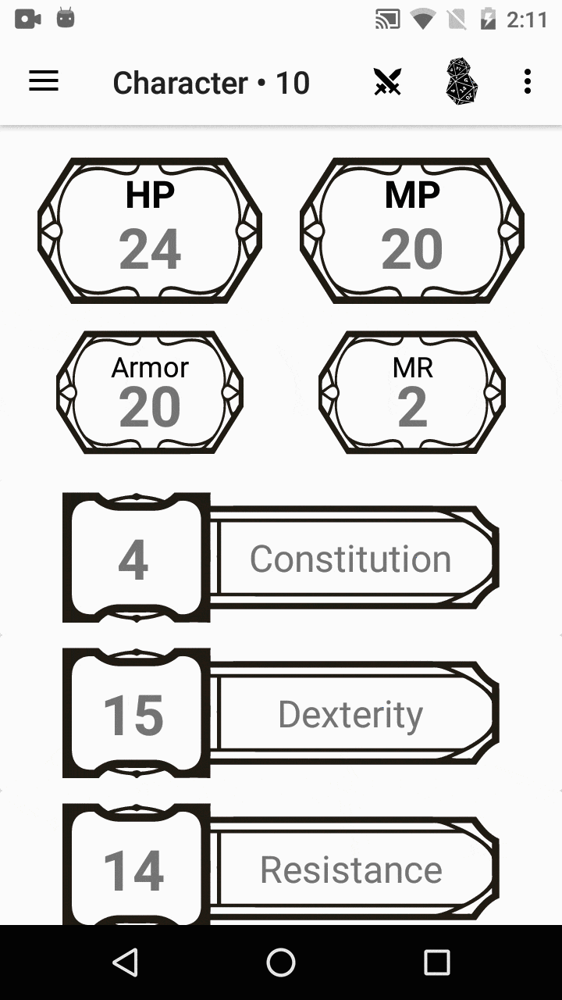

# RPG Project

This is an App for RPG lovers

Create your characters and store their informations, items, weapons, spells, skills, XP control, Dice Roll and more

Also, it has a Tavern page, a kind of RPG Character's social media where you can post, like and comment


### Some Screens Demo


Attributes | Dice Roll | Experience
------------ | ------------- | -------------
 |  | 


Biography | Inventory | Inventory
------------ | ------------- | -------------
 |  |  


Tavern | Visiting Profile | Characters
------------ | ------------- | -------------
 |  |  

(All those shown images are only for demo purpose, you may replace them whenever you want)


## Getting Started

Download or clone the App

Then, enjoy it with your friends!

The App has a default Firebase Project associated to it

For a better experience and control, I strongly recommend you replace with your own Firebase Project and custom everything as you wish

The App was made with MVP architeture

### Prerequisites

* [Realtime Database](https://firebase.google.com/docs/database/android/start)
* [Storage](https://firebase.google.com/docs/storage/android/start)


### Installing and Customizing

* Follow the Firebase implementation guide

* Then you can custom the nodes in class

```java
StringNodes.java
public static final String NODE_CHARACTER = "character";
```


* And also, change the path in each of model objects as you want
```java
@Override
    public void saveInFirebase() {
        DatabaseReference databaseReference = FirebaseHelper.getFirebaseRef();

        databaseReference
                .child(NODE_CHARACTER)
                .child(this.userId)
                .child(generateId())
                .setValue(this);
    }
```

* To allow your users to post and comment don't forget to change the line to:
```java
this.canPost = true; //-- default: false
```


* Replace with your own background images changing the following drawable

```
\src\main\res\drawable\bg_default
```

* To use the Notification feature you must implements Firebase Cloud Messaging, get your Authorization Key and set it in NotificationService interface:
```java
public interface NotificationService {

    @Headers({
           "Authorization:key=YOUR_KEY_HERE",
           "Content-Type:application/json"
    })
    @POST("send")
    Call<NotificationData>saveNotification(@Body NotificationData notificationData);
}
```


Notification Strings:
```xml
<string name="notification_commented_post">%1$s commented your %2$s post</string>
<string name="notification_new_post">%1$s made a new post</string>
```


* The Damage Calculator has a specific formula (in Damage model class) which is:

* Physical Damage:
```java
	int restrictedConst = constitution;
        if (restrictedConst > 80)
            restrictedConst = 80;

        int firstDamageLayer = (int) ((damage - armor) - (constitution /2));
        double constPercentage = (1- (double) restrictedConst/100);

        if (isPercentage) {
            double modifierCalc = (1 + ((double) modifier / 100));
            return  (int) ( (firstDamageLayer * constPercentage) * modifierCalc );
        }
        else {
            return (int) ( (firstDamageLayer * constPercentage) + modifier );
        }
```

* Magic Damage:
```java
	int restrictedMr = mr;
        if (restrictedMr > 60)
            restrictedMr = 60;

        int firstDamageLayer = (int) ((damage - mr) - (mr /2));
        double mrPercentage = (1- (double) restrictedMr/100);

        if (isPercentage) {
            double modifierCalc = (1 + ((double) modifier / 100));
            return  (int) ( (firstDamageLayer * mrPercentage) * modifierCalc );
        }
        else {
            return (int) ( (firstDamageLayer * mrPercentage) + modifier );
        }
```

* Hybrid Damage:
```java
	double armorMr = (armor + mr)/2;
        int restrictedConst = constitution;
        int restrictedMr = mr;
        int restrictedConsMR;

        if (restrictedConst > 80)
            restrictedConst = 80;

        if (restrictedMr > 60)
            restrictedMr = 60;

        restrictedConsMR = (int)((restrictedConst + restrictedMr) /2);


        int firstDamageLayer = (int) ((damage - armorMr) - (constitution /4));
        double consMRPercentage = (1- (double) restrictedConsMR/100);

        if (isPercentage) {
            double modifierCalc = (1 + ((double) modifier / 100));

            return  (int) ( (firstDamageLayer * consMRPercentage) * modifierCalc );
        }
        else {
            return (int) ( (firstDamageLayer * consMRPercentage) + modifier );
        }
```

### Supported Languages

* **English - US**
* **Portuguese - BR**


## Custom Libraries Credits

* **CircleImageView** - [Henning Dodenhof](https://github.com/hdodenhof)
* **Glide** - [Bump Technologies](https://github.com/bumptech)
* **LikeButton** - [Joel Dean](https://github.com/jd-alexander)
* **Custom Activity On Crash library** - [Eduard Ereza Martínez](https://github.com/Ereza)
* **CircleMenu** - [Ramotion](https://github.com/Ramotion)
* **Retrofit** - [Square](https://square.github.io/retrofit/)


## Contributing
Pull requests are welcome. For major changes, please open an issue first to discuss what you would like to change.


## License
This project is licensed under the MIT License - see the LICENSE.txt file for details


## Authors

* **Gabriel "L" Kuniyoshi** - *Initial work* - [L](https://github.com/kiraitami)


